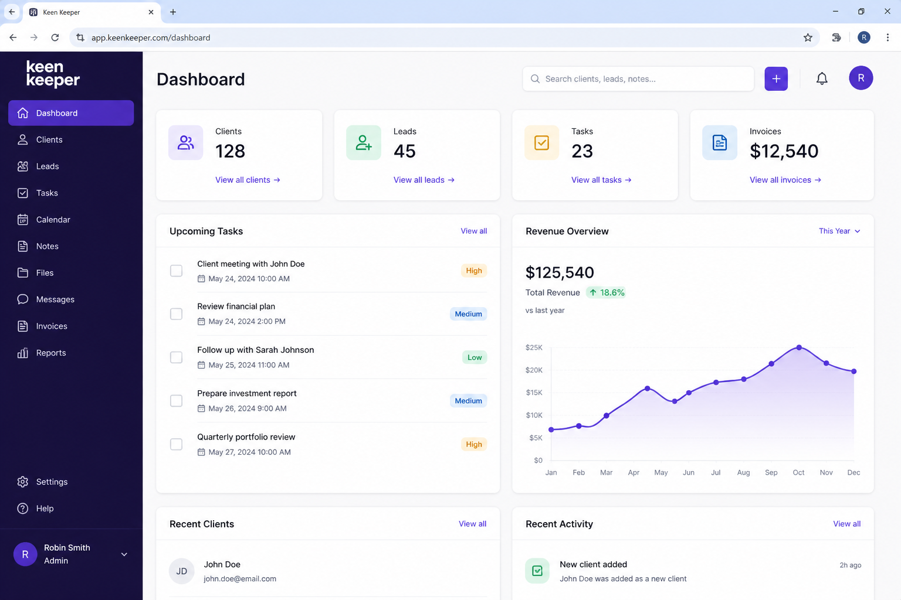

# 🌐 Keen Keeper Portfolio

**Keen Keeper** is a modern portfolio web application where users can explore projects, view detailed information, and experience a clean, responsive UI built with modern web technologies.

---

## 📸 Screenshot



---

## ⚙️ Tech Stack

* Next.js (App Router)
* React.js
* Tailwind CSS
* JavaScript (ES6+)

---

## ✨ Main Features

* 📁 Project showcase with dynamic routing
* 🔍 View detailed project information
* ⚡ Fast performance using Next.js
* 📱 Fully responsive design
* 🎨 Clean and modern UI

---

## 📦 Dependencies

* next
* react
* react-dom
* tailwindcss

---

## 🚀 Run Locally

Follow these steps to run the project on your local machine:

### 1️⃣ Clone the repository

```
git clone https://github.com/kazij317-code/B13-A7-keen-keeper.git
```

### 2️⃣ Go to project folder

```
cd B13-A7-keen-keeper
```

### 3️⃣ Install dependencies

```
npm install
```

### 4️⃣ Run the project

```
npm run dev
```

### 5️⃣ Open in browser

```
http://localhost:3000
```

---

## 🔗 Relevant Links

* 🌐 Live Site: https://kazij317-code.github.io/B13-A7-keen-keeper/
* 💻 GitHub Repo: https://github.com/kazij317-code/B13-A7-keen-keeper

---

## 📌 Future Improvements

* 🔐 Add authentication system
* 🗄️ Connect with database (MongoDB)
* 🖼️ Upload and manage projects dynamically
* 🌍 Deploy with full backend support

---

## 👨‍💻 Author

**Kazi Jamshed Alam**

---


<!-- ------------------------------------------------------- -->
# 👥 KeenKeeper

## 📖 Project Name
KeenKeeper

---

## 📝 Short Description
KeenKeeper is a simple and responsive React-based web application designed to help users keep track of their friendships and interactions. Users can search, filter, and sort their timeline of activities easily.

---

## 🛠 Technologies Used
- React.js
- React Router DOM
- Context API
- Tailwind CSS
- DaisyUI
- React-hot-toast
- Lucide React Icons
- JavaScript (ES6+)
- Recharts

---

## ✨ Key Features

### 🔍 1. Smart Search
Users can search timeline entries by friend name or interaction type (Call, Text, Video).

### 🔽 2. Filter System
Filter timeline activities based on interaction type for better organization.

### ⏱ 3. Sort Timeline
Sort all activities by newest or oldest to quickly view recent or past interactions.

