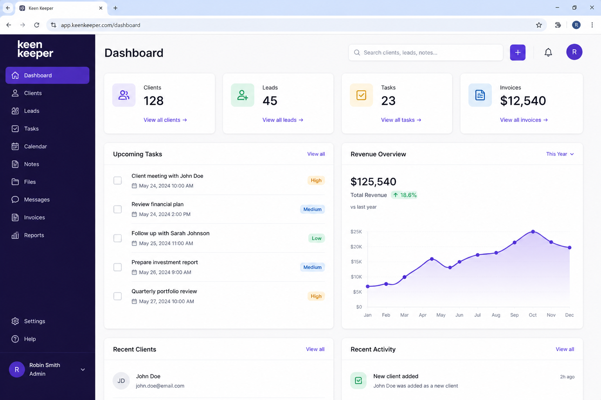

# 📚 Keen Keeper – Book Management Platform

A modern and responsive book management web application that allows users to explore, organize, and manage their reading collection. Built with React.js and modern frontend technologies, Keen Keeper provides an intuitive user experience for tracking books, managing reading lists, and discovering new content.

---

## 🌐 Live Demo

🔗 https://kazij317-code.github.io/B13-A7-keen-keeper/

---

## 📂 GitHub Repository

🔗 https://github.com/kazij317-code/B13-A7-keen-keeper

---

## 📸 Screenshot



---

## ✨ Main Features

### 📖 Book Collection Management

- Browse available books
- View detailed book information
- Organize personal reading collection
- User-friendly book management system

### 🔍 Search & Filtering

- Search books by title
- Filter books by category
- Easy navigation and discovery

### 📚 Reading List Features

- Add books to reading list
- Track reading progress
- Manage favorite books

### 🎨 Modern User Interface

- Clean and intuitive design
- Responsive layout for all devices
- Interactive user experience

### ⚡ Performance Optimization

- Fast page loading
- Optimized React components
- Smooth user interactions

---

## 🛠️ Tech Stack

### Frontend

- React.js
- JavaScript (ES6+)
- HTML5
- CSS3
- Tailwind CSS

### Libraries & Tools

- React Router
- React Icons
- Local Storage API
- Git & GitHub

### Deployment

- GitHub Pages

---

## 📦 Key NPM Packages

```bash
react
react-dom
react-router-dom
react-icons
tailwindcss
```

---

## 🚀 Setup Instructions

### 1. Clone the Repository

```bash
git clone https://github.com/kazij317-code/B13-A7-keen-keeper.git
```

### 2. Navigate to the Project Directory

```bash
cd B13-A7-keen-keeper
```

### 3. Install Dependencies

```bash
npm install
```

### 4. Start Development Server

```bash
npm run dev
```

### 5. Build for Production

```bash
npm run build
```

---

## 🔑 Environment Variables

This project does not require environment variables.

If future integrations are added (such as APIs or authentication services), create a `.env` file and store sensitive information securely.

---

## 👤 Demo Access

No login credentials are required.

The application is publicly accessible.

---

## 🧪 Testing Notes

### Functional Testing

✅ Browse books

✅ View book details

✅ Add books to reading list

✅ Navigate between pages

### Responsive Testing

✅ Mobile devices

✅ Tablets

✅ Desktop browsers

### User Experience Testing

✅ Navigation functionality

✅ Interactive UI elements

✅ Layout consistency

---

## 📁 Project Structure

```text
B13-A7-keen-keeper/
│
├── public/
├── src/
│   ├── assets/
│   ├── components/
│   ├── pages/
│   ├── layouts/
│   ├── routes/
│   ├── utilities/
│   └── main.jsx
│
├── package.json
└── README.md
```

---

## 🚀 Future Improvements

- User authentication system
- Cloud database integration
- Personalized recommendations
- Advanced search and filtering
- Book reviews and ratings
- Reading statistics dashboard
- Dark mode support
- Book wishlist functionality

---

## 👨‍💻 Author

### Kazi Jamshed Alam (Mithu)

Frontend Developer | MERN Stack Developer

📧 Email: kazij317@gmail.com

🌐 Portfolio:
https://kazi-jamshed-alam-portfolio-website.vercel.app

💼 LinkedIn:
https://www.linkedin.com/in/kazi-jamshed-alam

🐙 GitHub:
https://github.com/kazij317-code

---

## 🤝 Contributing

Contributions, suggestions, and feedback are welcome.

Feel free to fork the repository, create a feature branch, and submit a pull request.

---

## ⭐ Support

If you found this project useful, please consider giving it a star on GitHub.
